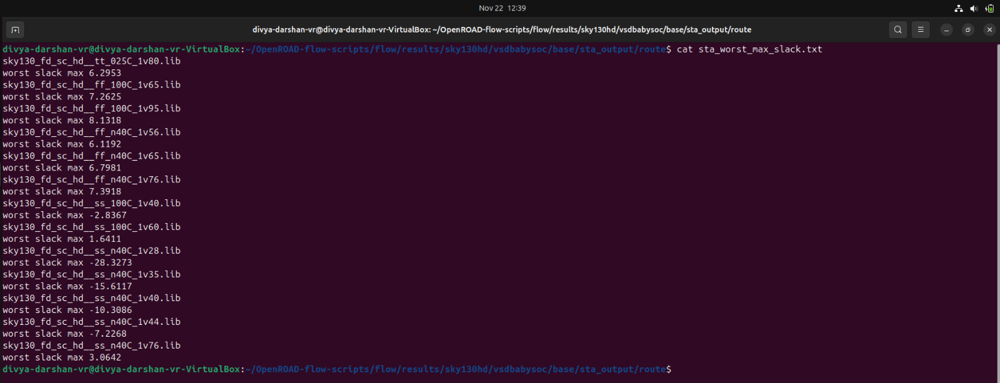
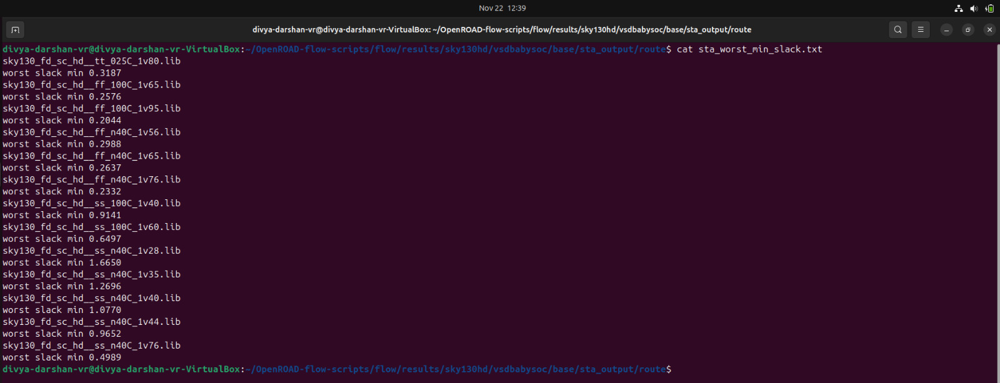
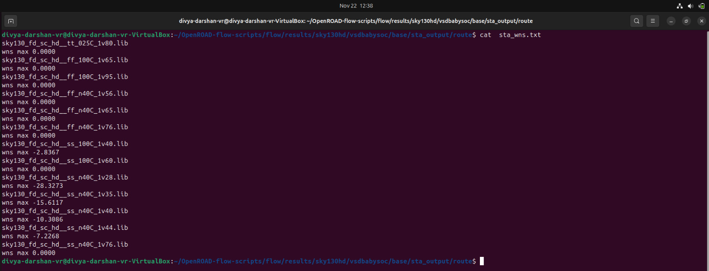
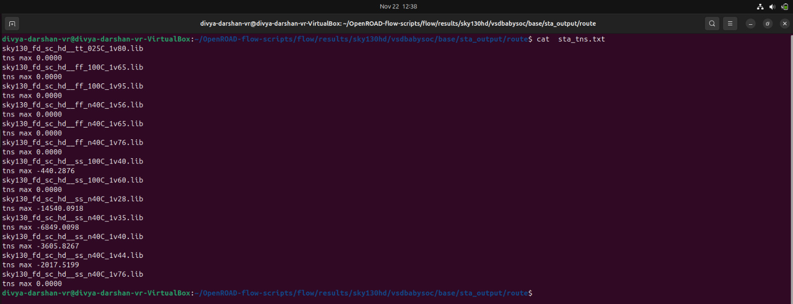
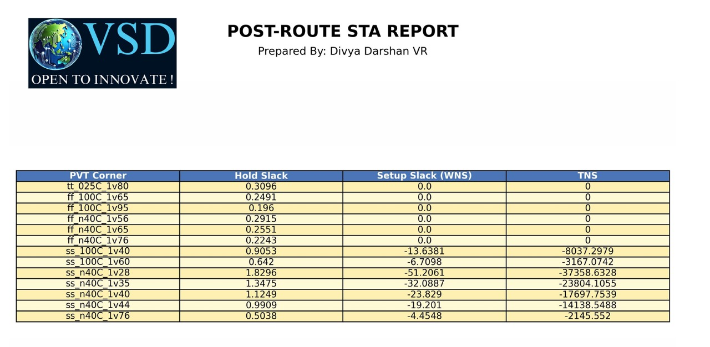
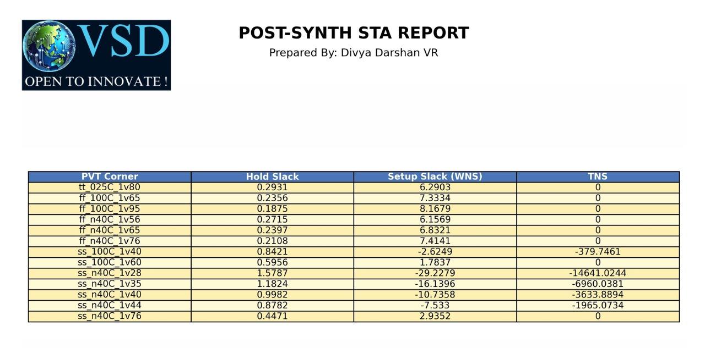
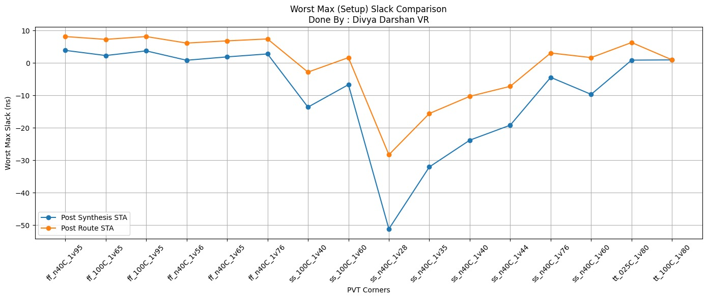
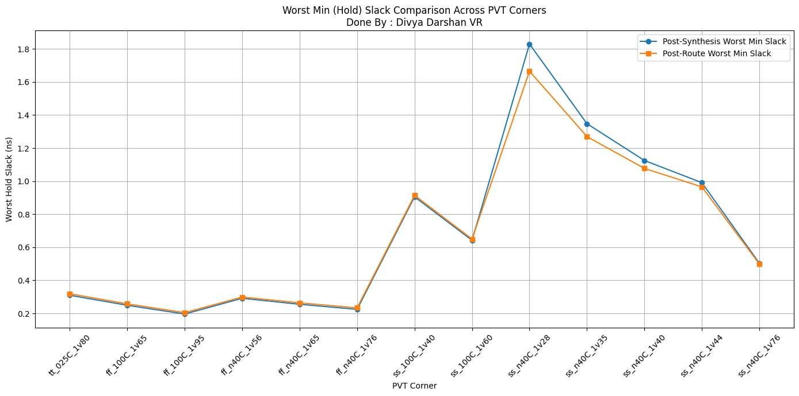
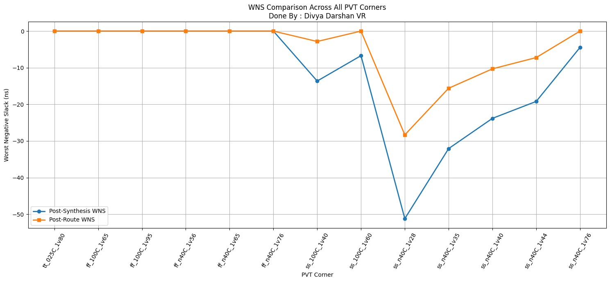
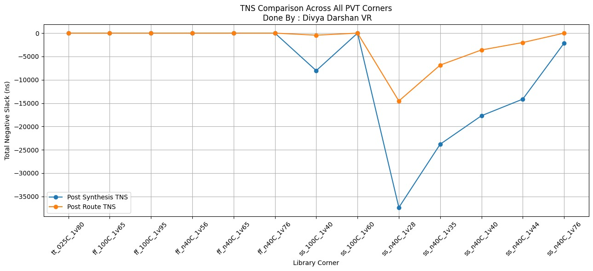

# Week 8 - RISC-V SoC Tapeout Journey (Divya Darshan)
[](https://github.com/DivyaDarshan09/Divya_Darshan-VSD-RISCV-week-8)
[](https://github.com/DivyaDarshan09)

---
## Post-Layout STA & Timing Graphs Across PVT Corners for Routed VSDBabySoC

This repository documents the work done in Week 8 of my 20-week RISC-V SoC Tapeout project powered by VLSI System Design (VSD) and IIT Gandhinagar.

---
## Objective
To perform Post-Layout Static Timing Analysis (STA) using the SPEF generated after
routing in Week 7, analyze timing across all PVT corners, and compare post-route results
with post-synthesis timing data from Week 3.

---
## Post-Route Timing Verification

- After completing routing for the VSDBabySoC design, reliable timing verification is performed using OpenSTA. This stage involves three key inputs:

    - **sta_across_pvt_route.tcl** – A dedicated TCL script that automates STA across multiple PVT  (Process, Voltage, Temperature) corners.

    - **vsdbabysoc_post_cts.sdc** – The post-CTS timing constraints generated after clock tree synthesis.`(I have my file named 4_cts.sdc,because of VSDbabysoc Makefile script )`

    - **vsdbabysoc.spef** – The post-route SPEF file containing extracted parasitic resistance and capacitance values.`(I have my file named 6_final.spef)`

- By combining these elements, OpenSTA evaluates the design under realistic operating and physical conditions. The script ensures timing checks such as setup/hold slack, WNS (Worst Negative Slack), and TNS (Total Negative Slack) for each timing library corner, enabling the detection of critical timing violations early. This process helps validate whether the routed design will operate correctly in silicon under different manufacturing and environmental variations.
---
## Post Route Multi-Corner PVT Timing Analysis of VSDBabySoC using OpenSTA

### Multi-PVT Corners in STA
**Definition:**
In Static Timing Analysis (STA), Multi-PVT Corners refer to evaluating the design under multiple combinations of Process, Voltage, and Temperature (PVT) conditions. These corners help ensure that the design meets timing constraints across all expected operating conditions.

## Components of PVT:

**Process (P):**
Variations in manufacturing, e.g., slow (SS), typical (TT), fast (FF) transistors.
Accounts for chip-to-chip variability.

**Voltage (V):**
Variations in supply voltage, e.g., nominal, high, low.
Ensures timing is robust against power supply fluctuations.

**Temperature (T):**
Variations in operating temperature, e.g., -40°C, 25°C, 125°C.
Models the effect of thermal conditions on transistor speed.

---
### Purpose of Multi-PVT Corners:

- STA at a single corner is insufficient for real-world conditions.
- Multi-PVT analysis ensures the design meets timing and functional requirements under all expected scenarios:

    - Fast Process + High Voltage + Low Temperature → fastest circuits, check hold violations.
    - Slow Process + Low Voltage + High Temperature → slowest circuits, check setup violations.

**Example Scenarios:**

- `Fast Corner:` FF transistors at -40 °C, 1.95 V → circuits are faster; checks hold violations (data may arrive too early).
- `Slow Corner:` SS transistors at 100 °C, 1.40 V → circuits are slower; checks setup violations (data may arrive too late).

## Timing Libraries for Multi-PVT Analysis

The timing libraries required for this analysis can be downloaded from the **SkyWater PDK**:

- **SkyWater PDK – sky130_fd_sc_hd Timing Libraries**  
  - These libraries provide **process-, voltage-, and temperature-specific timing models** needed for accurate STA.  
  - You can download them from the official [SkyWater PDK repository](https://github.com/google/skywater-pdk) or the timing library package link provided by the PDK.
---
 
## Using the Multi-PVT TCL Script for STA

We are going to use the `sta_across_pvt_route.tcl` script to **automate Static Timing Analysis (STA) across multiple PVT corners**. This allows us to verify that the design meets timing constraints under all **process, voltage, and temperature conditions** without manually switching libraries or rerunning analyses.

---
### Steps Performed by the Script:

1. **Load PVT-specific timing libraries**  
   - Example: `sky130_fd_sc_hd__ss_100C_1v40.lib` for a **slow-slow, high-temperature, low-voltage** corner.  

2. **Link the post route netlist**  
   - Ensures the same RTL design is used for all corners.  

3. **Apply SDC constraints**  
   - Clocks, input/output delays, and timing exceptions are applied consistently for each corner.  

4. **Run timing checks**  
   - Includes **setup, hold, worst negative slack (WNS), total negative slack (TNS)** for each corner.  

5. **Save detailed reports**  
   - Generates a **separate report for each PVT corner** under `./sta_outputs/` for analysis.  

### Benefits:

- Provides **comprehensive timing validation** across all operating conditions.  
- Automates repetitive STA tasks, saving **time and effort**.  
- Identifies **worst-case paths** for setup and hold, ensuring reliable chip operation after post route.  

---
## Script to run Post Route STA for all corners

```
#--------------------------------------------------------
#--------------------------------------------------------
  Post Route Multi-corner STA Automation Script 
#--------------------------------------------------------
            Author : Divya Darshan VR
#--------------------------------------------------------
#--------------------------------------------------------

# Define list of timing libraries (corners)

set list_of_lib_files(1) "sky130_fd_sc_hd__tt_025C_1v80.lib"
 set list_of_lib_files(2) "sky130_fd_sc_hd__ff_100C_1v65.lib"
 set list_of_lib_files(3) "sky130_fd_sc_hd__ff_100C_1v95.lib"
 set list_of_lib_files(4) "sky130_fd_sc_hd__ff_n40C_1v56.lib"
 set list_of_lib_files(5) "sky130_fd_sc_hd__ff_n40C_1v65.lib"
 set list_of_lib_files(6) "sky130_fd_sc_hd__ff_n40C_1v76.lib"
 set list_of_lib_files(7) "sky130_fd_sc_hd__ss_100C_1v40.lib"
 set list_of_lib_files(8) "sky130_fd_sc_hd__ss_100C_1v60.lib"
 set list_of_lib_files(9) "sky130_fd_sc_hd__ss_n40C_1v28.lib"
 set list_of_lib_files(10) "sky130_fd_sc_hd__ss_n40C_1v35.lib"
 set list_of_lib_files(11) "sky130_fd_sc_hd__ss_n40C_1v40.lib"
 set list_of_lib_files(12) "sky130_fd_sc_hd__ss_n40C_1v44.lib"
 set list_of_lib_files(13) "sky130_fd_sc_hd__ss_n40C_1v76.lib"

#---------------------------------------------
#  Load design libraries 
#---------------------------------------------

 read_liberty /home/divya-darshan-vr/OpenSTA/examples/timing_libs/avsdpll.lib
 read_liberty /home/divya-darshan-vr/OpenSTA/examples/timing_libs/avsddac.lib

#---------------------------------------------
#  Loop through each .lib file (corner)
#---------------------------------------------

 for {set i 1} {$i <= [array size list_of_lib_files]} {incr i} {

# Read design and constraints

 read_liberty /home/divya-darshan-vr/OpenSTA/examples/timing_libs/$list_of_lib_files($i)
 read_verilog /home/divya-darshan-vr/OpenROAD-flow-scripts/flow/results/sky130hd/vsdbabysoc/base/vsdbabysoc_post_place.v
 link_design vsdbabysoc
 current_design
 read_sdc /home/divya-darshan-vr/OpenROAD-flow-scripts/flow/results/sky130hd/vsdbabysoc/base/4_cts.sdc
 read_spef /home/divya-darshan-vr/OpenROAD-flow-scripts/flow/results/sky130hd/vsdbabysoc/base/6_final.spef

 # Perform timing checks
 check_setup -verbose

#-----------------------------------------
# Generate detailed reports
#-----------------------------------------

 report_checks -path_delay min_max -fields {nets cap slew input_pins fanout} -digits {4} > /home/divya-darshan-vr/OpenROAD-flow-scripts/flow/results/sky130hd/vsdbabysoc/base/sta_output/route/min_max_$list_of_lib_files($i).txt

#---------------------------------------------------
# Save key metrics (WNS, TNS, Setup & Hold Slack )
#---------------------------------------------------

 exec echo "$list_of_lib_files($i)" >> /home/divya-darshan-vr/OpenROAD-flow-scripts/flow/results/sky130hd/vsdbabysoc/base/sta_output/route/sta_worst_max_slack.txt
 report_worst_slack -max -digits {4} >> //home/divya-darshan-vr/OpenROAD-flow-scripts/flow/results/sky130hd/vsdbabysoc/base/sta_output/route/sta_worst_max_slack.txt

 exec echo "$list_of_lib_files($i)" >> /home/divya-darshan-vr/OpenROAD-flow-scripts/flow/results/sky130hd/vsdbabysoc/base/sta_output/route/sta_worst_min_slack.txt
 report_worst_slack -min -digits {4} >> /home/divya-darshan-vr/OpenROAD-flow-scripts/flow/results/sky130hd/vsdbabysoc/base/sta_output/route/sta_worst_min_slack.txt

 exec echo "$list_of_lib_files($i)" >> /home/divya-darshan-vr/OpenROAD-flow-scripts/flow/results/sky130hd/vsdbabysoc/base/sta_output/route/sta_tns.txt
 report_tns -digits {4} >> /home/divya-darshan-vr/OpenROAD-flow-scripts/flow/results/sky130hd/vsdbabysoc/base/sta_output/route/sta_tns.txt

 exec echo "$list_of_lib_files($i)" >> /home/divya-darshan-vr/OpenROAD-flow-scripts/flow/results/sky130hd/vsdbabysoc/base/sta_output/route/sta_wns.txt
 report_wns -digits {4} >> /home/divya-darshan-vr/OpenROAD-flow-scripts/flow/results/sky130hd/vsdbabysoc/base/sta_output/route/sta_wns.txt
 }
 ```
 ## How to run Multi-PVT corner analysis

 ```bash
 # Run sta in the terminal
sta

# It will Go to OpenSTA interactive shell (denoted by %)
% source multi_pvt_corners.tcl 
```
## STA Output
- After successfull analysis of multi pvt corners, it produces 4 important output files. They are,

```bash
sta_tns.txt
sta_wns.txt
sta_worst_max_slack.txt
sta_worst_min_slack.txt
```
**Screenshot of sta_worst_max_slack.txt**



---
**Screenshot of sta_worst_max_slack.txt**



---
**Screenshot of wns.txt**



---
**Screenshot of tns.txt**



---
## Pre Route (VS) Post Route STA Analysis

- `Pre-Route STA` evaluates timing on the netlist after logic synthesis using library delays and ideal interconnects. It provides an early estimate of setup/hold slack and identifies critical paths.

- `Post-Route STA` analyzes timing after placement, clock tree synthesis, and routing using actual parasitic RC delays from the routed design. It reflects realistic timing, often showing reduced slack compared to post-synthesis, and highlights paths affected by routing and clock tree insertion.

- Comparing the two stages across multiple PVT corners helps verify timing closure, identify worst-case conditions, and guide optimization for reliable silicon performance.

## Multi- Corner PVT Timing Comparision Summary (Week 3 (VS) Week 8)
- Here is a tabulated view of the key timing results generated by the STA script before and after `routing`.

**Post Route**




**Pre Route (Post Synthesis)**



---
### Setup Slack Comparison: Post-Synth vs Post-Route Across PVT Corners



**Observation**
- Setup slack generally decreases post-route because data arrival times increase with routing parasitics.
- Indicates tighter margins on critical paths, especially under worst-case PVT corners.
---
### Hold Slack Comparison: Post-Synth vs Post-Route Across PVT Corners



**Observation**
- Hold slack reduces slightly after routing due to shorter paths or clock skew variations.
- Shows increased sensitivity to potential hold violations in the final routed design.
---
### WNS Comparison: Post-Synth vs Post-Route Across PVT Corners



**Observations**
- WNS decreases after routing due to parasitic RC delays introduced by actual interconnects.
- Highlights critical paths that are more timing-constrained post-route.
---
### TNS Comparison: Post-Synth vs Post-Route Across PVT Corners



**Observations**
- TNS increases (more negative) post-route as cumulative slack across paths reduces.
- Reflects the overall impact of routing and CTS on timing closure.
---

## Inference from Multi PVT Corners slack analysis

- The analysis of hold slack, setup slack, and total negative slack across all process corners reveals that the worst-case timing occurs in the ss_n40C_1v28 corner, with significant setup violations.
- Hold timing is generally safe across corners. The total negative slack highlights cumulative violations, guiding optimization priorities.
- Focus should be on critical paths in the slowest corners to achieve timing closure and reliable operation.
---

### Week-3 vs Week-8 Timing Comparison (STA with PVT Corners)

## Summary Table

| Timing Metric | Week-3 (Pre-Route) | Week-8 (Post-Route with SPEF) | Result Interpretation |
|---|---|---|---|
| **WNS – Worst Negative Slack** | **-51.7061 ns** | **-28.3273 ns** | Routing and CTS reduced critical path violations and improved worst-case paths. |
| **TNS – Total Negative Slack** | **-37358.63 ns** | **-14540.09 ns** | Significant reduction in total failing paths after realistic routed parasitic extraction. |
| **WSS – Worst Setup Slack (Max Path)** | **+3.2138 ns** | **+8.1318 ns** | Setup margins improved due to timing balancing and CTS. |
| **WHS – Worst Hold Slack (Min Path)** | **-0.3040 ns** | **+0.2044 ns (All corners positive)** | All hold violations resolved after routing, indicating stable clock arrival and data paths. |

---

## Key Observations

✔ **Routing and CTS enhanced overall timing**, with noticeable improvement in WNS and TNS across PVT corners.  
✔ **Post-route SPEF analysis provided accurate timing visibility**, incorporating real interconnect RC parasitics.  
✔ **Setup slack improved after routing**, indicating better critical path balancing and clock distribution.  
✔ **Hold slack turned fully positive in all corners**, showing effective mitigation of short-path and clock skew issues.

---

## Conclusion

- Post-route STA was carried out using OpenSTA with extracted SPEF to include real parasitic effects.
- Multi-corner PVT analysis provided accurate timing evaluation under different operating conditions.
- Comparison with post-synthesis results showed reductions in WNS, TNS, setup slack, and hold slack due to routing and CTS.
- Timing degradation identified helps locate critical paths that may need further optimization.
- Ensures the BabySoC design is validated under realistic physical conditions before final sign-off.
---

