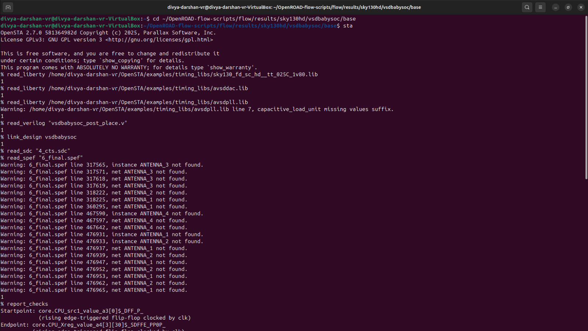
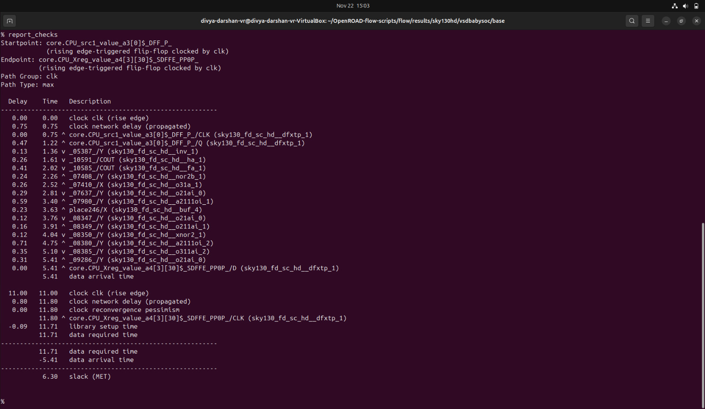
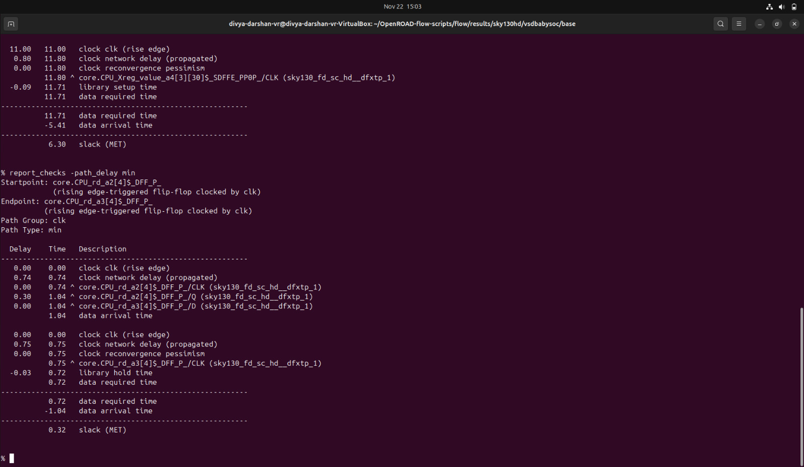
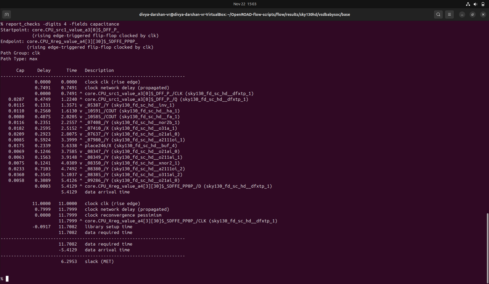
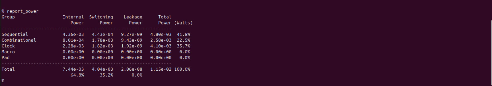
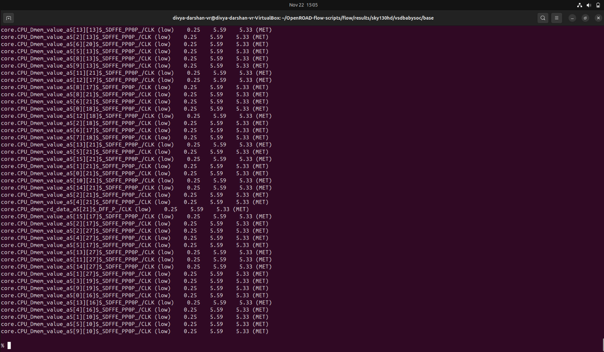
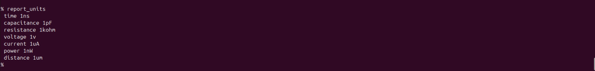
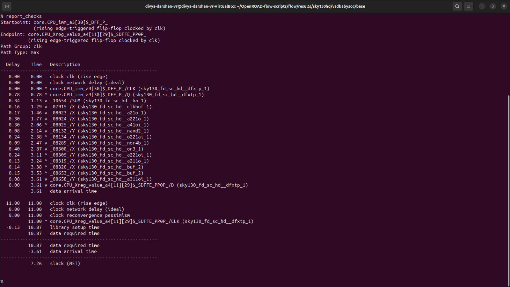
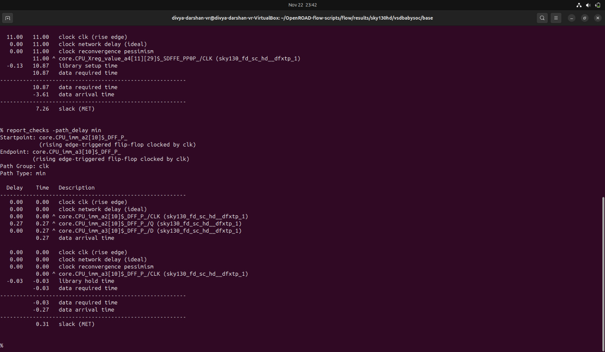
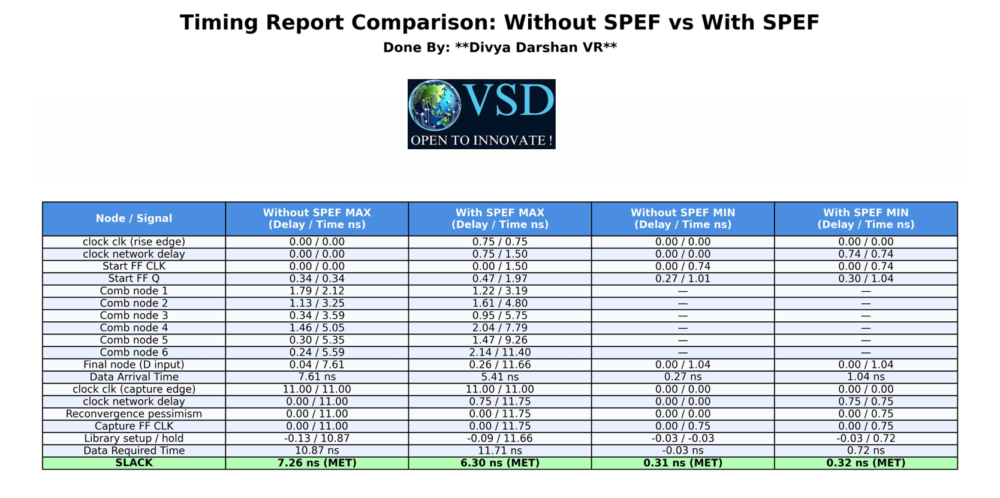

# SPEF-Based Timing Analysis
---
**Definition:**
- SPEF is a standardized textual file format that provides detailed parasitic information (resistance, capacitance, and sometimes inductance) of a chip’s routing interconnects, which is used for accurate post-layout timing analysis (STA).

**Key Points:**

- Captures RC parasitics of nets after placement and routing.
- Used by Static Timing Analysis (STA) tools to compute delay, slew, and crosstalk effects.
- Ensures timing closure by reflecting realistic interconnect delays.
- Comes in two main types:
    - Unit SPEF: resistances in ohms, capacitances in farads.
    - Scaled SPEF: values scaled by a factor for readability.

**Summary:**
SPEF bridges the gap between layout parasitics and accurate timing analysis.

---
## vsdbabysoc.spef file Screenshot


- It contains the parasitic information (resistance, capacitance, and sometimes inductance) of the design (Here it is VSDBabySoC).

---
## Steps to do SPEF Based Timing Analysis

```bash
# Change to the directory containing the files
cd ~/OpenROAD-flow-scripts/flow/results/sky130hd/vsdbabysoc/base

# Invoke the OpenSTA tool
sta

# Load the standard cell timing library (Liberty format)
read_liberty /home/divya-darshan-vr/OpenSTA/examples/timing_libs/sky130_fd_sc_hd__tt_025C_1v80.lib
read_liberty /home/divya-darshan-vr/OpenSTA/examples/timing_libs/avsddac.lib
read_liberty /home/divya-darshan-vr/OpenSTA/examples/timing_libs/avsdpll.lib

# Load the post routed Verilog netlist for analysis
read_verilog vsdbabysoc_post_place.v

# Link the top-level module in the Verilog netlist with the loaded timing library
% link_design vsdbabysoc

# Load the constraint file
% read_sdc 4_cts.sdc

# Load the parasitic SPEF file for accurate delay calculation
% read_spef 6_final.spef

# Generate timing report for max check
report_checks

# Generate timing report for min check
report_checks -path_delay min
```
---

**Screenshot:** Terminal output



---
**Screenshot:** SPEF Based Max path Check



---
**Screenshot:** SPEF Based Min path Check



---
### Capacitance Analysis
- Generate a report of parasitic or electrical checks with a focus on capacitances.

**Command:**
```bash
report_checks -digits 4 -fields capacitance
```


---
## Power Report Analysis
- Generates a **power analysis report** for your design.
- Computes **dynamic, static, and total power** for the circuit.

**Command:**
```bash
report_power
```


---

## Pulse Width Checks

- Checks the **pulse width of signals** in your design.
- Ensures that **short glitches or narrow pulses** do not violate timing constraints.
- Important for **setup/hold integrity** and **avoiding false switching**.

**Command:**
```bash
report_pulse_width_checks
```




---
## Report Units
- Displays the **units of measurement** currently used in the STA tool.

**Command:**
```bash
report_units
```


---
## Steps to do Timing Analysis Without SPEF

```bash
# Change to the directory containing the files
cd ~/OpenROAD-flow-scripts/flow/results/sky130hd/vsdbabysoc/base

# Invoke the OpenSTA tool
sta

# Load the standard cell timing library (Liberty format)
read_liberty /home/divya-darshan-vr/OpenSTA/examples/timing_libs/sky130_fd_sc_hd__tt_025C_1v80.lib
read_liberty /home/divya-darshan-vr/OpenSTA/examples/timing_libs/avsddac.lib
read_liberty /home/divya-darshan-vr/OpenSTA/examples/timing_libs/avsdpll.lib

# Load the post routed Verilog netlist for analysis (Kindly enter the file name as it is in your device)
read_verilog 1_synth.v

# Link the top-level module in the Verilog netlist with the loaded timing library
% link_design vsdbabysoc

# Load the constraint file (Kindly enter the file name as it is in your device)
% read_sdc 1_synth.sdc

# Generate timing report for max check
report_checks

# Generate timing report for min check
report_checks -path_delay min
```
## Report of STA Without SPEF 

**Screenshot:** Max path Check



**Screenshot:** Min path Check



---
## Timing Report Comparison: Without SPEF vs With SPEF



## Observation from the table

### 1. Propagation Delay Increases After SPEF

- After including SPEF parasitics, every stage in the data path shows increased delay.

```bash
For example:

Comb node 6:
Without SPEF → 5.59 ns
With SPEF    → 11.40 ns
```
- This is due to increased resistance–capacitance loading from routed wires.

### 2. Clock Network Delay Increases

- Clock tree routing adds significant latency:
```bash
Clock delay:
Without SPEF → 0.00
With SPEF    → 0.75 / 1.50
```
- This means real clock insertion delay is modeled only after SPEF extraction.

### 3. Data Arrival Time Increases

```bash
Data Arrival Time:
Without SPEF →  7.61 ns  
With SPEF    → 11.66 ns
```
- This shows a large cumulative delay addition once routing parasitics are considered.

### 4. Required Time Adjusted

- Due to updated timing models and clock adjustments, the required time changes slightly after SPEF. The analyzer computes updated setup or hold constraints accordingly.

### 5. No Timing Violations

- Even after parasitics are included, timing still closes successfully:

```bash
Slack (Setup):
Without SPEF → 7.26 ns
With SPEF    → 6.30 ns

Slack (Hold):
All paths → MET
```

- This confirms that:

    - No setup violations occurred
    - No hold violations occurred
    - The design remains timing clean even after realistic parasitic inclusion
---
## Conclusion
- Pre-route timing analysis without SPEF is optimistic.
- Post-route timing analysis with SPEF models real delays introduced by routed wires.
- SPEF-based STA is mandatory for accurate signoff before tape-out.
- The design continues to meet timing requirements even after SPEF, indicating robust implementation and good layout quality.